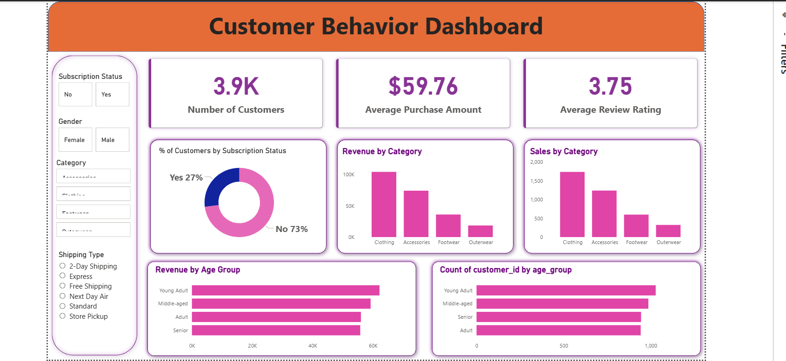

# Customer Shopping Behavior Analysis Dashboard

## Overview

This project analyzes customer shopping behavior using SQL, Python, and Power BI. The objective is to uncover customer purchasing patterns, spending trends, and demographic insights that can help businesses make data-driven decisions.

---

## Business Problem

Retail businesses generate large amounts of customer transaction data. Understanding customer preferences and purchasing behavior is essential for improving customer satisfaction, increasing revenue, and optimizing marketing strategies.

This project focuses on identifying key factors that influence customer purchases and generating actionable business insights.

---

## Tools Used

* SQL Server
* Python
* Pandas
* NumPy
* Power BI
* Jupyter Notebook

---

## Dataset Features

The dataset contains information such as:

* Customer ID
* Age
* Gender
* Item Purchased
* Category
* Purchase Amount
* Location
* Size
* Color
* Season
* Review Rating
* Subscription Status
* Shipping Type
* Previous Purchases
* Payment Method
* Frequency of Purchases

---

## Analysis Performed

### SQL Analysis

* Revenue by gender
* Revenue by product category
* Customer purchase frequency
* Customer spending analysis
* Product popularity analysis

### Python Analysis

* Data cleaning
* Exploratory Data Analysis (EDA)
* Statistical summaries
* Visualization of customer trends

### Power BI Dashboard

* Revenue Overview
* Customer Demographics
* Category Performance
* Seasonal Trends
* Purchase Behavior Insights

---

## Key Insights

* Identified customer segments generating the highest revenue.
* Analyzed spending patterns across demographic groups.
* Evaluated the impact of customer purchase frequency on revenue.
* Determined the most popular product categories.
* Examined seasonal shopping trends.

---

## Repository Structure

data/ 
dashboard/
sql/
docs/
screenshots/ 
README.md

## Dashboard Preview

## Author

Sameer

Data Analytics | SQL | Python | Power BI
